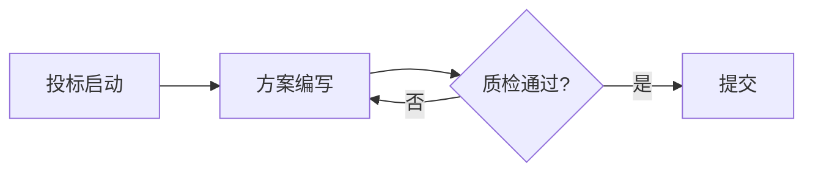

# 📝 bid-toolkit — 标书自动化工具链 v4.1

> AI写标书不是新鲜事，但"AI按你的格式规范严格生成文档"才是真正的提效。

> 💡 **项目定位：轻量级可复用 skill，Agent 直接调用脚本即可，无需安装大型应用或配置 LLM。**

## 这是什么

一套面向招投标从业者的标书自动化工具链，覆盖 **招标文件生成 → 招标文件拆解 → 框架搭建与锁定
→ Word 排版 → 格式自检 → 质量质检 → 脱敏** 的完整流程。

**核心卖点：不是让AI帮你写标书内容（那谁都会），而是让AI按照招标文件的格式规范严格生成文档。**

---

## 🤖 两个 Skill（一个仓库，两侧能力）

本仓库同时提供**招标侧**与**投标侧**两套 Agent 技能，共用同一套规则库与排版引擎：

| Skill | 文件 | 站在谁那边 | 干什么 |
|-------|------|-----------|--------|
| **投标侧** | [`SKILL.md`](SKILL.md) | 投标人 / 供应商 | 拿到招标文件后做投标文件：审标、搭框架、排版、质检、脱敏、RAG 检索 |
| **招标侧** | [`rfp/SKILL.md`](rfp/SKILL.md) | 招标人 / 代理机构 | 生成招标文件（货物/服务/工程）、审查其合规性与法律风险 |

Agent 使用者请直接读对应的 `SKILL.md`；本文件是人类阅读的项目说明。

---

## 功能一览

| 功能 | 说明 |
|------|------|
| **🔍 招标文件拆解** | 读取PDF/Markdown招标文件，自动提取格式要求、废标红线、文件清单、大纲框架、评分项、预算、时间节点、资质要求，输出结构化JSON |
| **Markdown → Word** | 一键生成标准格式Word文档，自动处理标题层级、表格、图片 |
| **全角半角检测** | 自动扫描并修复中英文标点混用（标书废标第一杀手） |
| **格式自检** | 检查字体、缩进、行距、页边距是否符合招标要求 |
| **门卫质检** | 生成前自动检查占位符、禁用词、必要章节 |
| **暗标模式** | 自动替换公司标识，适配暗标投标 |
| **合规词库** | 禁用词/规范词配置，防止夸大承诺、绝对化用语 |
| **标书查重** | SimHash算法检测文本相似度，防止串标/雷同 |
| **判词库管理** | 可积累的禁用词/敏感词/规范词系统，支持AI发现新词+人工审批 |
| **Mermaid图表** | Markdown中的Mermaid代码块自动渲染为图片插入Word |
|| **多格式模板** | 内置4套格式模板：政府采购 / 企业投标 / 工程类 / 货物类，一行切换；服务类另含5子类型大纲模板（咨询/消防/档案/人力/物业）——IT运维模板v3.6补充 |
| **标书类型识别** | 自动识别货物标/服务标/工程标，匹配对应内容大纲和检查规则（v3.4新增） |
| **三类内容大纲** | 货物标/服务标/工程标差异化章节模板，不再一套模板打天下（v3.4新增） |
| **投标文件生成器** | 招标文件→投标文件初稿一键生成，7步流水线（解析→类型检测→大纲→素材→LLM生成→组装→Word），支持断点续生成（v3.5新增） |
| **踩坑检查器** | 15条规则扫描投标文件，检测绝对化用语/资质过期/人员冲突/金额大小写不一致等常见踩坑问题（v3.5新增） |
| **资质响应检查器** | 对比招标要求与投标文件，检查资质是否完整响应、证书有效期是否覆盖项目期（v3.5新增） |
| **下划线格式检查器** | 检查Word文档下划线格式是否符合配置规则，检测遗漏和类型不符（v3.5新增） |
| **招标文件深度解析** | 新增评分项/废标条款/资质要求专项提取，输出结构化JSON（v3.5增强） |
| **四套提示词模板** | 项目分析/技术方案/商务标/自审，可直接用于LLM生成投标文件（v3.5新增） |
|| **标书风险扫描** | 231条判决词三层审标管线：关键词定检→上下文判断→反向覆盖检查，输出风险清单（v3.6新增） |
|| **标书智能生成器** | 填Web表单→一键生成标准版标书Word，支持脱敏/草稿保存/三模板分支（v3.6新增） |
|| **素材库管家** | 素材自动分类整理（8大分类+46条命名规则）+ 规则自适应学习（人确认后写回keywords.json）+ 投标必备材料清单已有/缺失状态（v3.9新增） |
|| **自定义配置** | 修改config.yaml即可适配任何招标文件的格式要求 |
| **下划线保留** | 保留下划线占位符格式，如 `致：_________（招标人）` |

## 开源版能力边界（重要）

本仓库是 **开源版（MIT）**，定位为「纯 Python 命令行工具链」——你用 `bid` 命令跑全套脚本，或 Agent 直接调脚本即可，**无需安装大型应用、无需配置 LLM**（见顶部说明）。

✅ **开源版包含**（均为 CLI 子命令）：

- **排版引擎**：`render`（content.json → Word，真实 Heading 1-5 样式 + numbering.xml 自动编号）、`engine`（Markdown → Word）
- **质检防线**：`check`、`review`（三层审标管线）、`desense`（AI味检测 + 敏感信息脱敏）、`commitments`（承诺链审计）、`map-clauses`（条款映射审计）
- **编排引擎**：`orchestrate`（框架锁定 / 差异检测 / 铁律校验 / 原文锚定）
- **招标侧**：`rfp` 命令 + 独立脚本 `rfp/rfp_generator.py`（生成）、`rfp/rfp_compliance.py`（9 类合规检查）、`rfp/compliance_rules/`（可配置规则库）
- **辅助工具**：`analyze`（可行性分析）、`materials`（素材库管家）、`table`（两列表格）、`watermark`、`rag`（零依赖 BM25 检索）、`gui`（桌面图形界面）
- 可选的 LLM 功能（`bid_generator` / `bid_analyzer` 的 AI 生成、AI味雷达）需**自备 API Key**，默认关闭，不影响其余命令离线可用

❌ **不属于开源版**（属付费版 / 路线图，**不在本仓库**）：

- Agent 自动写稿（多智能体协作自动生成标书内容）
- MCP 接入（与外部系统的标准协议对接）
- 私有云 / LLM 托管服务
- **真实标书案例库**（脱敏后的历史标书语料 / 行业判词库 / 评分项-方案映射库）
- 企业知识库 RAG 高级对接（多库路由、跨标引用、权限隔离）

> 一句话：**开源"怎么做"，闭源"做什么"和"用什么做"**。
> 本仓库开源的是**方法与引擎**——生成、排版、审查、质检的完整能力；
> 不包含任何真实项目的招标文件、标书案例库或企业私有数据。

## 快速开始

### 一行命令安装

```bash
pip install git+https://github.com/charlotty2026/bid-toolkit.git
```

装完直接跑：

```bash
# Markdown → Word 标书排版
bid engine 标书.md -o 标书.docx

# 标书格式自检
bid check 标书.docx

# 生成招标文件（服务类）
bid rfp --type services --project "XX物业服务项目" --budget 500000

# 敏感信息脱敏扫描
bid desense 标书.docx

# 招标文件风险扫描（三层审标管线）
bid review 招标文件.pdf -o 审标报告.md

# 审标 + 查覆盖（指定投标书）
bid review 招标文件.pdf --bid-file 投标书.md -o 审标报告.md

# 审标输出JSON（适合CI自动化）
bid review 招标文件.pdf -o 审标报告.json

# 素材库初始化（8大分类目录+规则库+必备材料清单）
bid materials init 素材库目录

# 扫描素材库 → 生成整理计划（plan.md）
bid materials analyze 素材库目录

# 执行整理（移动+重命名+写回素材清单xlsx）
bid materials apply 素材库目录

# 对照投标必备材料清单，看缺什么
bid materials status 素材库目录

# 自适应学习：教它认识新文件（规则自动生长）
bid materials learn 素材库目录 --llm
```

> 💡 还在用 `git clone + cd scripts + python xxx.py` 五步大法？装完 `bid` 命令全局可用，零门槛。

---

## 🚀 AI PC 增强：OpenVINO 本地向量（推荐）

bid-toolkit 的 RAG 检索默认走零依赖 BM25（克隆即用），需要语义向量时可一键升级到
**OpenVINO 本地推理**——把 `BAAI/bge-small-zh-v1.5` 转成 OpenVINO IR，**推理全程纯本地、不上云**，
在 Intel AI PC 上把算子卸载到 **核显 / NPU**，CPU 兜底。详见 [`SKILL.md`](SKILL.md) 的「零依赖本地 RAG」章节。

构建（仅首次，构建期需 `pip install openvino torch transformers`；运行期只需 `openvino` + `tokenizers`，不加载 torch）：

```bash
python tools/build_ov_model.py              # 构建 FP16 IR 到 ~/.cache/bid_toolkit/ov/
python tools/build_ov_model.py --benchmark  # 额外跑 CPU / iGPU 性能对比
python tools/build_ov_model.py --fp32       # 纯 CPU 机器可选 FP32（约 90MB）
```

启用：

```bash
set BID_RAG_EMBED_BACKEND=openvino          # 等价：export ...
bid rag ingest 历史标书.md --project demo
bid rag query "投标保证金" --project demo --top-k 5
```

默认设备 `AUTO:GPU,CPU`（自动挑最快可用设备并兜底 CPU）；NPU 机型设 `BID_RAG_OV_DEVICE=NPU`。
混合检索：本地向量库同时维护 BM25 倒排索引，检索时用语义向量 Top-N 与关键词 Top-N 做 **RRF 融合**，
互补更稳（招投标文本专有名词、条款号、数字指标多，纯语义易漏精确匹配）。

> 说明：OpenVINO 是**可选增强**。未构建 IR 时自动降级 BM25，主链路零依赖、零配置、零 API。

### 传统方式（不装包直接跑）

```bash
git clone https://github.com/charlotty2026/bid-toolkit.git
cd bid-toolkit
pip install -r requirements.txt
python scripts/bid_engine.py 标书.md -o 标书.docx
```

```bash
# 拆解PDF招标文件，输出JSON
python scripts/parse_bid.py 招标文件.pdf -o requirements.json --pretty

# 拆解Markdown版本的招标文件
python scripts/parse_bid.py 招标文件.md -o requirements.json --pretty

# 输出摘要（废标红线N条/文件清单N项/大纲标题N个...）
```

输出的JSON包含：
- **格式要求**（字体/字号/行距/页边距）
- **废标红线**（否决条款）
- **文件清单**（必须提交的材料）
- **大纲框架**（投标文件构成+格式+评分项）
- **预算金额**
- **时间节点**（截标/开标/答疑）
- **资质要求**

### 基础用法

```bash
# Markdown → Word（自动修复全角半角）
python scripts/bid_engine.py 你的标书.md -o 输出.docx

# 使用政府采购模板
python scripts/bid_engine.py 你的标书.md --template government -o 输出.docx

# 使用企业投标模板（仿宋+固定28磅行距）
python scripts/bid_engine.py 你的标书.md --template enterprise -o 输出.docx

# 使用工程类模板
python scripts/bid_engine.py 你的标书.md --template engineering -o 输出.docx

# 使用自定义配置
python scripts/bid_engine.py 你的标书.md --config my_config.yaml -o 输出.docx

# 仅扫描全角半角（不生成Word）
python scripts/md2docx.py 你的标书.md --scan

# 暗标模式（去公司标识）
python scripts/bid_engine.py 你的标书.md --暗标 -o 输出.docx

# 生成后自动质检
python scripts/bid_engine.py 输出.docx --check
```

### Python API

```python
from scripts.bid_engine import md_to_docx, load_config, build_specs

# 加载配置
config = load_config(template_name='government')  # 或 'enterprise' / 'engineering'

# Markdown文本 → Word
md_to_docx("# 服务方案\n\n这里是内容...", "标书.docx", config=config)

# 保留下划线格式
from scripts.bid_engine import preserve_underlines
text = "致：_________（招标人）"
text = preserve_underlines(text, {"致：": "致：示例招标单位"})
# → "致：示例招标单位（招标人）"
```

## 格式模板

项目内置3套格式模板，覆盖常见投标场景：

### 政府采购模板 (`government`)
| 项目 | 规范 |
|------|------|
| 正文 | 宋体小四(12pt) 首行缩进2字符 1.5倍行距 两端对齐 |
| 一级标题 | 宋体三号(16pt) 左对齐 |
| 二级标题 | 宋体小三(15pt) 左对齐 |
| 页边距 | 上下2.54cm 左右2.00cm |

### 企业投标模板 (`enterprise`)
| 项目 | 规范 |
|------|------|
| 正文 | 仿宋小四(12pt) 首行缩进2字符 固定28磅行距 |
| 标题 | 黑体加粗 |
| 页边距 | 上下2.54cm 左右2.50cm |

### 工程类模板 (`engineering`)
| 项目 | 规范 |
|------|------|
| 正文 | 宋体小四(12pt) 固定28磅行距 |
| 标题 | 黑体加粗 |
| 页边距 | 上下3.00cm 左2.50cm 右2.00cm |

### 货物类模板 (`goods`) v3.4新增
| 项目 | 规范 |
|------|------|
| 正文 | 仿宋小四(12pt) 首行缩进2字符 1.5倍行距 |
| 标题 | 黑体加粗 |
| 页边距 | 上下2.54cm 左2.50cm 右2.00cm |
| 特有配置 | 报价表列定义、中小企业声明函货物模式、质保条款默认值 |

### 标书类型识别 v3.4新增

内置关键词+信号评分机制，自动判断招标文件属于哪种类型：

```bash
# parse_bid.py 拆解时会自动输出标书类型
python scripts/parse_bid.py 招标文件.pdf -o requirements.json --pretty
# 输出包含："bid_type": "goods", "confidence": 5
```

识别结果决定使用哪个内容大纲模板和专项检查规则：

| 类型 | 内容大纲 | 专项检查项 |
|------|---------|-----------|
| 货物标 | goods_outline.md | 制造商信息/质保期/交货期/技术参数/产地品牌一致性 |
| 服务标 | service_outline.md | 劳务派遣证/人员配置/响应时间/中小企业声明函 |
| 工程标 | engineering_outline.md | 安全生产许可证/建造师/工程量清单/施工组织设计 |

配置文件：`templates/bid_type_detection.yaml`

编辑 `config.yaml` 即可适配任何招标文件的格式要求：

> ⚠️ 下面的字体/字号/行距只是示例值。**实际使用时必须从招标文件中提取具体要求**，不要照搬示例。

```yaml
body:
  font: "仿宋"        # 字体：宋体/仿宋/黑体/楷体
  size: 12             # 字号(pt)
  line_spacing: 28     # 行距：1.5=1.5倍 / 28=固定28磅
  first_indent_chars: 2 # 首行缩进字符数

headings:
  h1:
    font: "黑体"
    size: 16
    bold: true
  h2:
    font: "黑体"
    size: 15
    bold: true

page:
  margin_top: 2.54     # 上边距(cm)
  margin_left: 2.00    # 左边距(cm)

quality:
  forbidden_words:      # 禁用词列表
    - "保证中标"
    - "100%成功率"
```

## 下划线占位符处理

标书中常见的格式：
```
致：_________（招标人）
根据：_________（招标文件编号）
项目名称：_________
```

使用 `preserve_underlines` 函数，可以保留下划线和括号说明，同时填入实际内容：

```python
from scripts.bid_engine import preserve_underlines

text = "致：_________（招标人）"
result = preserve_underlines(text, {"致：": "致：示例招标单位"})
# 结果：致：示例招标单位（招标人）
# 括号内的"招标人"保留，下划线被替换为实际值
```

## 全角半角检测规则

| 检测项 | 严重程度 |
|--------|---------|
| 中文正文含英文逗号 `,` | 🔴 致命 |
| 中文正文含英文句号 `.` | 🔴 致命 |
| 中文正文含英文分号 `;` | 🟡 警告 |
| 中文括号混用 `()` | 🟡 警告 |
| 全角空格残留 | 🟠 建议修复 |

### 标书查重（v3.2 新增）

基于SimHash算法的文本相似度检测，防止串标/雷同。

```bash
# 比较两个文件
python scripts/bid_similarity.py compare 标书A.md 标书B.md

# 与历史库比对
python scripts/bid_similarity.py check 新标书.md --library ./samples/

# 添加标书到历史库
python scripts/bid_similarity.py add 标书.md --library ./samples/ --name "XX项目"
```

### 判词库管理（v3.2 新增）

可积累的禁用词/敏感词/规范词管理系统，支持AI发现新词+人工审批。

```bash
# 列出所有判词
python scripts/keyword_library.py list

# 添加禁用词
python scripts/keyword_library.py add --word "绝对没问题" --type forbidden --category "夸大承诺"

# 添加敏感词（带替代建议）
python scripts/keyword_library.py add --word "我司" --type sensitive --category "暗标敏感" --suggestion "投标人"

# AI发现新词→待审
python scripts/keyword_library.py suggest --word "某新词" --type forbidden

# 审批通过
python scripts/keyword_library.py approve --word "某新词" --type forbidden

# 扫描文件
python scripts/keyword_library.py scan 标书.md

# 从config.yaml导入现有词表
python scripts/keyword_library.py import --input config.yaml

# 导出纯词表给config.yaml用
python scripts/keyword_library.py export --output forbidden_words.txt
```

### Mermaid图表支持（v3.2 新增）

Markdown中的Mermaid代码块会自动渲染为图片插入Word文档。

````

````

需安装mermaid-cli：`npm install -g @mermaid-js/mermaid-cli`。未安装时自动退化为占位文本。

### 错别字检测（v3.3 新增）

89对常见错别字映射 + 65组同音字检测，支持pypinyin降级。

```bash
python scripts/bid_typo_check.py check 标书.docx
python scripts/bid_typo_check.py check 标书.docx --json
```

### 前后不一致检测（v3.3 新增）

检测投标文件中数字、日期、金额、名称的前后矛盾。

```bash
python scripts/bid_consistency_check.py check 标书.docx
python scripts/bid_consistency_check.py check 标书.docx --json
```

## 与易标（OpenBidKit）对比

| 能力 | bid-toolkit | 易标 OpenBidKit |
|------|:-----------:|:---------------:|
| **标书类型识别（货物/服务/工程）** | ✅ v3.4 | ❌ |
| **三类内容大纲模板** | ✅ v3.4 | ❌ |
| **Markdown->Word格式生成** | ✅ 35+格式修复函数 | ❌ |
| **AI生成投标文件** | ✅ v3.5 一键生成 | ✅ DeepSeek/火山方舟 |
| **踩坑/资质/下划线检查** | ✅ v3.5 三套检查器 | ❌ |
| **提示词模板** | ✅ v3.5 四套 | ❌ |
| **暗标模式（去公司标识）** | ✅ | ❌ |
| **桌面GUI** | ❌ 命令行 | ✅ Electron桌面应用 |
| **全角半角检测修复** | ✅ | ❌ |
| **图文图表生成** | ❌ | ✅ |
| **招标文件拆解->JSON** | ✅ | ❌ |
| **招标文件拆解→评分项** | ✅ v2.5c | ❌ |
| **错别字检测** | ✅ v3.3 | ✅ |
| **前后不一致检测** | ✅ v3.3 | ✅ |
| **标书查重** | ✅ SimHash | ✅ 元数据+目录+正文+图片 |
| **RFP招标文件生成器** | ✅ | ❌ |
| **多格式模板系统** | ✅ 3套 | ❌ |
| **技术栈** | Python纯后端 | Electron+React+TS |
| **License** | MIT | AGPL-3.0 |

**各自路线**：bid-toolkit走"纯Python命令行+格式铁律"路线，强在格式修复和暗标；易标走"桌面GUI+AI生成"路线，强在内容生成和可视化。两者互补，用户可按需选择甚至组合使用。

## RFP 招标文件生成器（v3.3 新增）

不止能写投标文件——现在还能**生成招标文件**和**检查合规性**。

从5份真实公开招标文件样本中归纳标准六章结构，支持货物/服务/工程三大类差异化生成，内置6条合规红线检测。

### 核心能力

| 功能 | 说明 |
|------|------|
| **招标文件生成** | 货物/服务/工程三类差异化模板，输出完整Markdown招标文件 |
| **合规检查** | 6条红线自动检测（资格排斥/评分模糊/废标缺失/等标期/中小企业政策/地域限制）|
| **评分表生成** | 四列评分法（评分项/分值/评审标准/证明材料），三类项目差异化分值 |
| **废标条款库** | 从真实样本提炼的废标条款模板，按项目类型自动匹配 |
| **采购需求模板** | 货物=技术规格+数量清单，服务=服务要求+质量标准，工程=技术条件+工程量清单 |

### 用法

```bash
# 生成招标文件（服务类）
python rfp/rfp_generator.py --type services --project "XX后勤服务项目" --budget 500000

# 生成Word文档
python rfp/rfp_generator.py --type goods --project "XX设备采购" --budget 2000000 --docx

# 合规检查招标文件
python rfp/rfp_compliance.py --rfp 招标文件.md --type services --format text
```

### 三类项目差异化

| 类型 | 章节数 | 价格分 | 技术分 | 商务分 |
|------|--------|--------|--------|--------|
| 货物类 | 8章51节 | 30 | 50 | 20 |
| 服务类 | 8章51节 | 10 | 60 | 30 |
| 工程类 | 11章58节 | 20 | 60 | 20 |

### 数据来源

- 样本来源：政府采购网、各省公共资源交易中心、发改委标准文件
- 法规依据：政府采购法、招标投标法、财政部87号令

---

## 投标文件生成器（v3.5 新增）

从"拆解招标文件"到"生成投标文件初稿"——一键打通全链路。

### 核心理念

投标文件80%是结构化骨架（商务标模板+技术标大纲），20%是需人工填充的关键内容。生成器自动完成80%的骨架搭建，把20%需手动填写的字段提取为`{占位符}`并汇总成`needs_manual`报告，人只补关键数据。

### 用法

```bash
# 一键生成投标文件（招标文件→投标文件初稿）
python scripts/bid_generator.py generate \
  --rfp 招标文件.pdf \
  --company company_profile/ \
  --output 投标文件.md

# 生成后自动转Word
python scripts/bid_generator.py generate \
  --rfp 招标文件.pdf \
  --company company_profile/ \
  --output 投标文件.md \
  --docx

# 断点续生成（中断后从上次位置继续）
python scripts/bid_generator.py generate \
  --rfp 招标文件.pdf \
  --company company_profile/ \
  --resume

# 仅解析招标文件（不生成内容）
python scripts/bid_generator.py parse --rfp 招标文件.pdf -o 招标摘要.json
```

### 7步流水线

```
招标文件.pdf
    ↓
1. parse_bid 解析 → 结构化JSON（格式要求/废标条款/评分项/资质要求）
    ↓
2. 类型检测 → 货物标/服务标/工程标（信号评分制）
    ↓
3. 加载大纲 → 对应类型的内容大纲模板（goods/service/engineering_outline.md）
    ↓
4. 加载素材 → company_profile/ 下的企业信息/资质/踩坑清单
    ↓
5. LLM生成技术标 → 逐章节生成（3次重试），严格对标评分项
    ↓
6. 组装Markdown → 商务标（模板填充）+ 技术标（LLM生成）+ 其他
    ↓
7. 可选Word转换 → 调用bid_engine.py生成格式化Word文档
```

### 关键特性

- **断点续生成**：每章节生成后保存checkpoint，中断后`--resume`从断点继续
- **降级模式**：未配置API key时，技术标全用模板+warning，不阻塞生成
- **占位符汇总**：所有`{占位符}`汇总到`needs_manual.txt`，列出字段名/所在章节/填写说明
- **商务标不调LLM**：商务标格式固定（投标函/报价表等），纯模板填充避免AI编数据
- **提示词模板**：`docs/prompts/` 下4套提示词模板，可自定义或替换

### 提示词模板（v3.5 新增）

| 模板 | 用途 | 输入变量 |
|------|------|---------|
| `project_analysis.md` | 解析招标文件，提炼8项结构化摘要 | `{rfp_content}` |
| `technical_proposal.md` | 逐章节生成技术标内容 | `{section_title}` `{section_requirements}` `{rfp_summary}` `{company_profile}` |
| `commercial_bid.md` | 商务标表格填写指引 | `{rfp_summary}` |
| `self_review.md` | 投标初稿自审，输出5类检查清单 | `{bid_content}` `{rfp_summary}` |

## 质量检查工具集（v3.5 新增）

生成投标文件后，用三套检查器做自动质检：

### 踩坑检查器

15条规则扫描投标文件，覆盖标书编制中最常见的踩坑问题：

```bash
python scripts/pitfall_check.py check 投标文件.md
python scripts/pitfall_check.py check 投标文件.docx --json
```

| 规则类别 | 检测内容 |
|---------|---------|
| 绝对化用语 | 保证中标/100%成功率/国内领先/国际先进 |
| 人员冲突 | 项目经理同时担任多个项目/同一人员出现在不同岗位 |
| 资质失效 | ISO证书/安全生产许可证等过期 |
| 虚假承诺 | 响应时间优于招标要求但无依据 |
| 暗标泄密 | 暗标中包含公司名称/标识 |
| 金额错误 | 大小写不一致 |
| 法规失效 | 引用已废止的法规标准 |
| 时间矛盾 | 承诺时间与合同要求矛盾 |

支持从 `company_profile/pitfalls.md` 加载自定义规则。

### 资质响应检查器

对比招标文件要求与投标文件实际响应：

```bash
python scripts/qualification_check.py check 投标文件.md --rfp 招标摘要.json
python scripts/qualification_check.py check 投标文件.md --rfp 招标摘要.json --json
```

检查项：
- 招标要求的每项资质是否在投标文件中有对应响应
- 资质证书有效期是否覆盖项目期（即将到期/已过期）
- 18种常见资质证书的别名映射（ISO9001/安全生产许可证/劳务派遣证等）

### 下划线格式检查器

检查Word文档中的下划线格式是否符合配置规则：

```bash
python scripts/underline_check.py check 投标文件.docx
python scripts/underline_check.py check 投标文件.docx --config user_config.yaml --json
```

检测内容：
- 应有下划线但未找到（漏填）
- 下划线类型不符（期望single，实际double等）
- 下划线文本与配置规则不匹配

### 招标文件深度解析（v3.5 增强）

parse_bid.py 新增3个专项提取函数：

```bash
# 原有功能不变，JSON输出新增3个字段
python scripts/parse_bid.py 招标文件.pdf -o 招标摘要.json --pretty
```

新增JSON字段：
- `scoring_items`：评分项列表（类别/项目/分值/评审标准）
- `disqualification_clauses`：废标条款列表（条款内容/来源章节）
- `qualification_requirements`：资质要求列表（要求内容/必备或可选/所需证书）

---

## 适用场景

- 投标文件编写与排版
- 技术方案文档格式化
- 商务标书标准化输出
- 任何需要"中文格式规范+Word输出"的文档场景

## 项目结构

项目按**甲方/乙方**双角色分区，一眼看懂哪边用哪块：

```
bid-toolkit/
│
├── 🏢 乙方工具（投标方）—— 写投标文件
│   ├── config.yaml                  # 格式配置（字体/字号/行距，改这里适配任何招标要求）
│   ├── templates/                   # 格式模板 + 内容大纲
│   │   ├── government.yaml          #   政府采购标准格式
│   │   ├── enterprise.yaml          #   企业投标通用格式
│   │   ├── engineering.yaml         #   工程类格式
│   │   ├── goods.yaml               #   货物类格式（v3.4）
│   │   ├── goods_outline.md         #   货物标内容大纲（v3.4）
│   │   ├── service_outline.md       #   服务标内容大纲（v3.4）
│   │   ├── engineering_outline.md   #   工程标内容大纲（v3.4）
│   │   └── bid_type_detection.yaml  #   标书类型识别规则（v3.4）
│   ├── scripts/                     # 核心脚本
│   │   ├── bid_engine.py            #   Markdown→Word转换引擎
│   │   ├── bid_generator.py         #   投标文件生成器（v3.5）
│   │   ├── parse_bid.py             #   招标文件拆解（PDF/MD→JSON，v3.5增强）
│   │   ├── md2docx.py               #   Markdown→Word转换（含全角半角扫描修复）
│   │   ├── fix_bid_format.py        #   Word格式修复（35+函数）
│   │   ├── bid_similarity.py        #   标书查重（SimHash）
│   │   ├── bid_search.py            #   标书知识库搜索（BM25）
│   │   ├── bid_typo_check.py        #   错别字检测
│   │   ├── bid_consistency_check.py #   前后不一致检测
│   │   ├── keyword_library.py       #   判词库管理
│   │   ├── pitfall_check.py         #   踩坑检查器（v3.5）
│   │   ├── qualification_check.py   #   资质响应检查器（v3.5）
│   │   ├── underline_check.py       #   下划线格式检查器（v3.5）
│   │   └── verify_pricing.py        #   报价核算
│   ├── docs/
│   │   └── prompts/                 #   提示词模板（v3.5）
│   │       ├── project_analysis.md  #     项目分析提示词
│   │       ├── technical_proposal.md #     技术方案生成提示词
│   │       ├── commercial_bid.md    #     商务标生成提示词
│   │       └── self_review.md       #     自审提示词
│   └── rules/
│       └── bid_rules.md             # 标书编制铁律（33条，7卷）
│
├── 🏛️ 甲方工具（招标方）—— 生成招标文件 + 合规检查
│   └── rfp/
│       ├── rfp_generator.py          # 招标文件生成（货物/服务/工程三类）
│       ├── rfp_compliance.py         # 合规检查（6条红线）
│       ├── rfp_structure.py          # 标准六章结构定义
│       ├── rfp_templates.py          # 评分表/废标条款/采购需求模板
│       ├── standard_structure.json   # 结构框架JSON
│       ├── compliance_rules/         # 合规规则库
│       ├── samples/                  # 公开招标文件样本
│       ├── laws/                     # 相关法律法规
│       └── test_rfp_systematic.py    # 系统性测试
│
├── 📚 共享资源
│   ├── docs/
│   │   ├── checklist.md              # 标书排版自检清单
│   │   ├── prompts.md                # AI标书提示词参考
│   │   ├── RFP甲方实测报告.md         # RFP模块测试报告
│   │   └── RFP验证报告.md             # RFP模块验证报告
│   ├── samples/                      # 示例标书文件（查重历史库默认路径）
│   ├── examples/
│   │   └── demo_bid.md               # 演示文件
│   └── requirements.txt              # Python依赖声明
│
├── README.md
└── LICENSE
```

## 贡献

欢迎PR。如果你在投标过程中踩过坑，把检测规则加进来。

## License

**CC BY-NC 4.0** (知识共享-署名-非商用 4.0 国际)

- ✅ 可以学习、研究、修改、分享
- ✅ 必须署名原作者 charlotty2026
- ❌ 禁止商业用途（出售、付费服务、捆绑商业产品）
- 商用需获得作者书面授权

完整协议文本：https://creativecommons.org/licenses/by-nc/4.0/legalcode

## 仓库地址

- GitHub: https://github.com/charlotty2026/bid-toolkit
- Gitee: https://gitee.com/fenglinhuoshanmen/bid-toolkit
