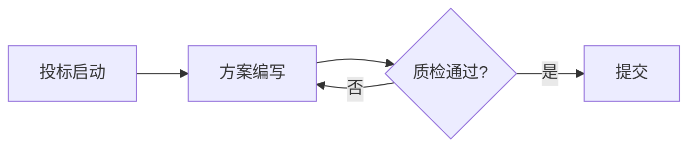

# 📝 bid-toolkit — 标书自动化工具包 v3.3

> AI写标书不是新鲜事，但"AI按你的格式规范严格生成文档"才是真正的提效。

## 这是什么

一套面向投标从业者的标书自动化工具链，覆盖从 **Markdown写稿 → Word生成 → 格式自检 → 质量质检** 的完整流程。

**核心卖点：不是让AI帮你写标书内容（那谁都会），而是让AI按照招标文件的格式规范严格生成文档。**

## 功能一览

| 功能 | 说明 |
|------|------|
| **🔍 招标文件拆解** | 读取PDF/Markdown招标文件，自动提取格式要求、废标红线、文件清单、大纲框架、评分项、预算、时间节点、资质要求，输出结构化JSON |
| **Markdown → Word** | 一键生成标准格式Word文档，自动处理标题层级、表格、图片 |
| **全角半角检测** | 自动扫描并修复中英文标点混用（标书废标第一杀手） |
| **格式自检** | 检查字体、缩进、行距、页边距是否符合招标要求 |
| **门卫质检** | 生成前自动检查占位符、禁用词、必要章节 |
| **暗标模式** | 自动替换公司标识，适配暗标投标 |
| **合规词库** | 禁用词/规范词配置，防止夸大承诺、绝对化用语 |
| **标书查重** | SimHash算法检测文本相似度，防止串标/雷同 |
| **判词库管理** | 可积累的禁用词/敏感词/规范词系统，支持AI发现新词+人工审批 |
| **Mermaid图表** | Markdown中的Mermaid代码块自动渲染为图片插入Word |
| **多格式模板** | 内置3套模板：政府采购 / 企业投标 / 工程类，一行切换 |
| **自定义配置** | 修改config.yaml即可适配任何招标文件的格式要求 |
| **下划线保留** | 保留下划线占位符格式，如 `致：_________（招标人）` |

## 快速开始

### 安装依赖

```bash
pip install python-docx markdown pyyaml PyMuPDF
```

### 拆解招标文件（v3.1 新增）

```bash
# 拆解PDF招标文件，输出JSON
python scripts/parse_bid.py 招标文件.pdf -o requirements.json --pretty

# 拆解Markdown版本的招标文件
python scripts/parse_bid.py 招标文件.md -o requirements.json --pretty

# 输出摘要（废标红线N条/文件清单N项/大纲标题N个...）
```

输出的JSON包含：
- **格式要求**（字体/字号/行距/页边距）
- **废标红线**（否决条款）
- **文件清单**（必须提交的材料）
- **大纲框架**（投标文件构成+格式+评分项）
- **预算金额**
- **时间节点**（截标/开标/答疑）
- **资质要求**

### 基础用法

```bash
# Markdown → Word（自动修复全角半角）
python scripts/bid_engine.py 你的标书.md -o 输出.docx

# 使用政府采购模板
python scripts/bid_engine.py 你的标书.md --template government -o 输出.docx

# 使用企业投标模板（仿宋+固定28磅行距）
python scripts/bid_engine.py 你的标书.md --template enterprise -o 输出.docx

# 使用工程类模板
python scripts/bid_engine.py 你的标书.md --template engineering -o 输出.docx

# 使用自定义配置
python scripts/bid_engine.py 你的标书.md --config my_config.yaml -o 输出.docx

# 仅扫描全角半角（不生成Word）
python scripts/format_check.py 你的标书.md --scan

# 暗标模式（去公司标识）
python scripts/bid_engine.py 你的标书.md --暗标 -o 输出.docx

# 生成后自动质检
python scripts/bid_engine.py 输出.docx --check
```

### Python API

```python
from scripts.bid_engine import md_to_docx, load_config, build_specs

# 加载配置
config = load_config(template_name='government')  # 或 'enterprise' / 'engineering'

# Markdown文本 → Word
md_to_docx("# 服务方案\n\n这里是内容...", "标书.docx", config=config)

# 保留下划线格式
from scripts.bid_engine import preserve_underlines
text = "致：_________（招标人）"
text = preserve_underlines(text, {"致：": "致：上海交通大学"})
# → "致：上海交通大学（招标人）"
```

## 格式模板

项目内置3套格式模板，覆盖常见投标场景：

### 政府采购模板 (`government`)
| 项目 | 规范 |
|------|------|
| 正文 | 宋体小四(12pt) 首行缩进2字符 1.5倍行距 两端对齐 |
| 一级标题 | 宋体三号(16pt) 左对齐 |
| 二级标题 | 宋体小三(15pt) 左对齐 |
| 页边距 | 上下2.54cm 左右2.00cm |

### 企业投标模板 (`enterprise`)
| 项目 | 规范 |
|------|------|
| 正文 | 仿宋小四(12pt) 首行缩进2字符 固定28磅行距 |
| 标题 | 黑体加粗 |
| 页边距 | 上下2.54cm 左右2.50cm |

### 工程类模板 (`engineering`)
| 项目 | 规范 |
|------|------|
| 正文 | 宋体小四(12pt) 固定28磅行距 |
| 标题 | 黑体加粗 |
| 页边距 | 上下3.00cm 左2.50cm 右2.00cm |

## 自定义配置

编辑 `config.yaml` 即可适配任何招标文件的格式要求：

> ⚠️ 下面的字体/字号/行距只是示例值。**实际使用时必须从招标文件中提取具体要求**，不要照搬示例。

```yaml
body:
  font: "仿宋"        # 字体：宋体/仿宋/黑体/楷体
  size: 12             # 字号(pt)
  line_spacing: 28     # 行距：1.5=1.5倍 / 28=固定28磅
  first_indent_chars: 2 # 首行缩进字符数

headings:
  h1:
    font: "黑体"
    size: 16
    bold: true
  h2:
    font: "黑体"
    size: 15
    bold: true

page:
  margin_top: 2.54     # 上边距(cm)
  margin_left: 2.00    # 左边距(cm)

quality:
  forbidden_words:      # 禁用词列表
    - "保证中标"
    - "100%成功率"
```

## 下划线占位符处理

标书中常见的格式：
```
致：_________（招标人）
根据：_________（招标文件编号）
项目名称：_________
```

使用 `preserve_underlines` 函数，可以保留下划线和括号说明，同时填入实际内容：

```python
from scripts.bid_engine import preserve_underlines

text = "致：_________（招标人）"
result = preserve_underlines(text, {"致：": "致：上海交通大学"})
# 结果：致：上海交通大学（招标人）
# 括号内的"招标人"保留，下划线被替换为实际值
```

## 全角半角检测规则

| 检测项 | 严重程度 |
|--------|---------|
| 中文正文含英文逗号 `,` | 🔴 致命 |
| 中文正文含英文句号 `.` | 🔴 致命 |
| 中文正文含英文分号 `;` | 🟡 警告 |
| 中文括号混用 `()` | 🟡 警告 |
| 全角空格残留 | 🟠 建议修复 |

### 标书查重（v3.2 新增）

基于SimHash算法的文本相似度检测，防止串标/雷同。

```bash
# 比较两个文件
python scripts/bid_similarity.py compare 标书A.md 标书B.md

# 与历史库比对
python scripts/bid_similarity.py check 新标书.md --library ./bid_library/

# 添加标书到历史库
python scripts/bid_similarity.py add 标书.md --library ./bid_library/ --name "XX项目"
```

### 判词库管理（v3.2 新增）

可积累的禁用词/敏感词/规范词管理系统，支持AI发现新词+人工审批。

```bash
# 列出所有判词
python scripts/keyword_library.py list

# 添加禁用词
python scripts/keyword_library.py add --word "绝对没问题" --type forbidden --category "夸大承诺"

# 添加敏感词（带替代建议）
python scripts/keyword_library.py add --word "我司" --type sensitive --category "暗标敏感" --suggestion "投标人"

# AI发现新词→待审
python scripts/keyword_library.py suggest --word "某新词" --type forbidden

# 审批通过
python scripts/keyword_library.py approve --word "某新词" --type forbidden

# 扫描文件
python scripts/keyword_library.py scan 标书.md

# 从config.yaml导入现有词表
python scripts/keyword_library.py import --input config.yaml

# 导出纯词表给config.yaml用
python scripts/keyword_library.py export --output forbidden_words.txt
```

### Mermaid图表支持（v3.2 新增）

Markdown中的Mermaid代码块会自动渲染为图片插入Word文档。

````

````

需安装mermaid-cli：`npm install -g @mermaid-js/mermaid-cli`。未安装时自动退化为占位文本。

### 错别字检测（v3.3 新增）

89对常见错别字映射 + 65组同音字检测，支持pypinyin降级。

```bash
python scripts/bid_typo_check.py check 标书.docx
python scripts/bid_typo_check.py check 标书.docx --json
```

### 前后不一致检测（v3.3 新增）

检测投标文件中数字、日期、金额、名称的前后矛盾。

```bash
python scripts/bid_consistency_check.py check 标书.docx
python scripts/bid_consistency_check.py check 标书.docx --json
```

## 与易标（OpenBidKit）对比

| 能力 | bid-toolkit | 易标 OpenBidKit |
|------|:-----------:|:---------------:|
| **Markdown->Word格式生成** | ✅ 35+格式修复函数 | ❌ |
| **AI生成技术方案** | ❌ | ✅ DeepSeek/火山方舟 |
| **暗标模式（去公司标识）** | ✅ | ❌ |
| **桌面GUI** | ❌ 命令行 | ✅ Electron桌面应用 |
| **全角半角检测修复** | ✅ | ❌ |
| **图文图表生成** | ❌ | ✅ |
| **招标文件拆解->JSON** | ✅ | ❌ |
| **错别字检测** | ✅ v3.3 | ✅ |
| **前后不一致检测** | ✅ v3.3 | ✅ |
| **标书查重** | ✅ SimHash | ✅ 元数据+目录+正文+图片 |
| **RFP招标文件生成器** | ✅ | ❌ |
| **多格式模板系统** | ✅ 3套 | ❌ |
| **技术栈** | Python纯后端 | Electron+React+TS |
| **License** | MIT | AGPL-3.0 |

**各自路线**：bid-toolkit走"纯Python命令行+格式铁律"路线，强在格式修复和暗标；易标走"桌面GUI+AI生成"路线，强在内容生成和可视化。两者互补，用户可按需选择甚至组合使用。

## 适用场景

- 投标文件编写与排版
- 技术方案文档格式化
- 商务标书标准化输出
- 任何需要"中文格式规范+Word输出"的文档场景

## 项目结构

```
bid-toolkit/
├── README.md              # 本文件
├── config.yaml            # 格式配置文件（自定义字体/字号/行距）
├── templates/             # 预设模板
│   ├── government.yaml    # 政府采购标准模板
│   ├── enterprise.yaml    # 企业投标通用模板
│   └── engineering.yaml   # 工程类投标模板
├── scripts/
│   ├── bid_engine.py            # Markdown->Word转换引擎（含Mermaid图表支持）
│   ├── bid_similarity.py        # 标书查重（SimHash）
│   ├── bid_typo_check.py        # 错别字检测（89对映射+同音字）
│   ├── bid_consistency_check.py # 前后不一致检测（数字/日期/金额/名称）
│   ├── keyword_library.py       # 判词库管理（禁用词/敏感词/规范词）
│   ├── format_check.py           # 全角半角检测与修复
│   ├── parse_bid.py             # 招标文件拆解（PDF/MD->JSON）
│   ├── fix_bid_format.py        # Word格式修复（35+函数）
│   └── verify_pricing.py        # 报价核算
├── rules/
│   └── bid_rules.md             # 标书编制铁律（33条，7卷）
├── docs/
│   ├── checklist.md             # 标书排版自检清单
│   └── prompts.md               # AI标书提示词参考（9条铁律+7个场景prompt）
└── examples/
    └── demo_bid.md              # 示例文件
```

## 贡献

欢迎PR。如果你在投标过程中踩过坑，把检测规则加进来。

## License

MIT

## 仓库地址

- GitHub: https://github.com/charlotty2026/bid-toolkit
- Gitee: https://gitee.com/fenglinhuoshanmen/bid-toolkit
